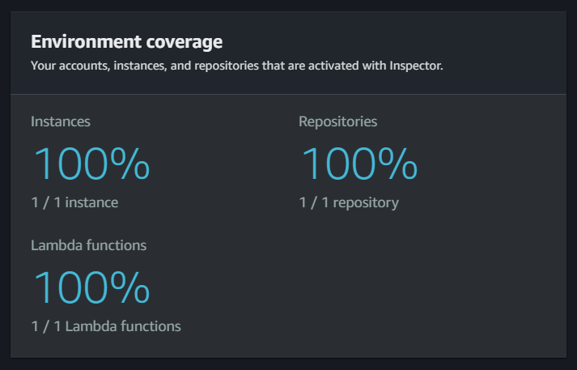
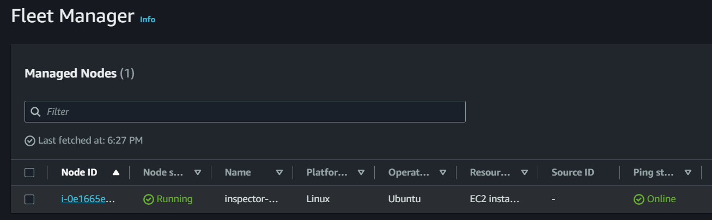
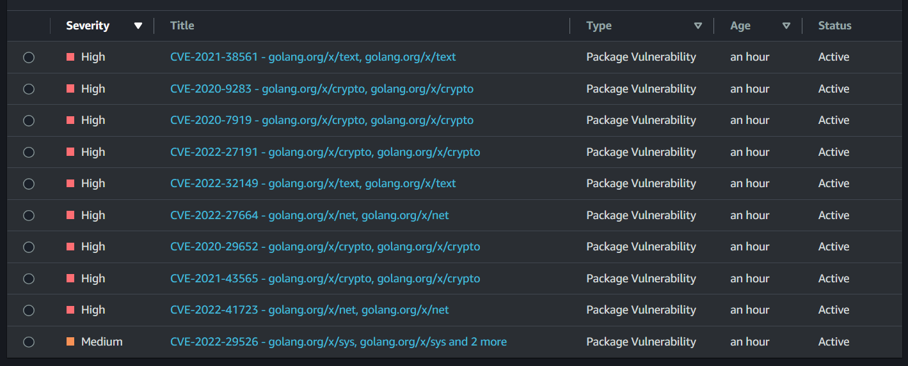

# AWS Inspector

Amazon Inspector vulnerability scan.

👉 Use the Console to enable Inspector.

👉 Also enable **Fleet Manager** to managed EC2 instances, `Default Host Management` is enough for testing.

Create the test resources:

```sh
terraform init
terraform apply -auto-approve
```

The configuration will create the following resources:

- Lambda
- ECR
- EC2

To scan an ECR image, upload one if none is available:

```sh
bash ecrBuildPush.bash
```

If all goes well, coverage should be 100% for all environments created by this config:



The EC2 instance should be found by the Fleet Manager:



For ECR, vulnerabilities should be shown on Inspector as well:


